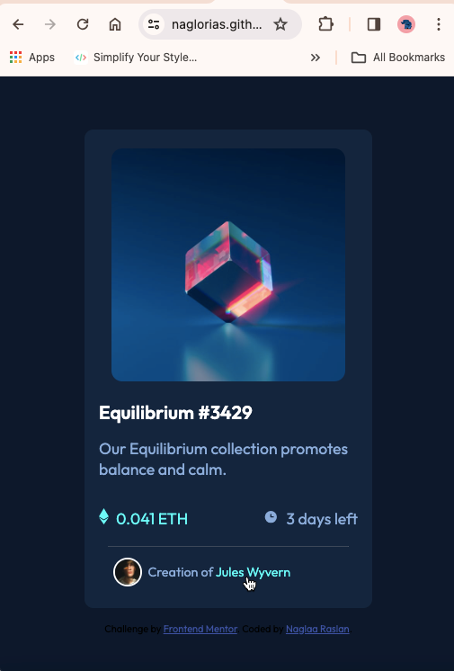

# Frontend Mentor - NFT preview card component solution

This is a solution to the [NFT preview card component challenge on Frontend Mentor](https://www.frontendmentor.io/challenges/nft-preview-card-component-SbdUL_w0U). Frontend Mentor challenges help you improve your coding skills by building realistic projects. 

## Table of contents

- [Overview](#overview)
  - [The challenge](#the-challenge)
  - [Screenshot](#screenshot)
  - [Links](#links)
- [My process](#my-process)
  - [Built with](#built-with)
  - [Continued development](#continued-development)
- [Author](#author)

**Note: Delete this note and update the table of contents based on what sections you keep.**

## Overview

### The challenge

Users should be able to:

- View the optimal layout depending on their device's screen size
- See hover states for interactive elements

### Screenshot
- Desktop screenshot version:;
- Mobile screenshot version:;
-Hover screenshot version : 
, 
, 
;
                       

### Links
- Solution URL: [Solution](https://github.com/naglorias/NFT-preview.git)
- Live Site URL: [NFT preview card](https://naglorias.github.io/NFT-preview/)

## My process

### Built with

- Semantic HTML5 markup
- CSS custom properties
- Flexbox

**Note: These are just examples. Delete this note and replace the list above with your own choices**

**Note: Delete this note and the content within this section and replace with your own learnings.**

### Continued development

 I should focus more on optimizing my measurements and units for font sizes, width, height and everything

in the box model. 

I should also practice more on functions like clamp() and calc() to improve  myself in using them.

**Note: Delete this note and the content within this section and replace with your own plans for continued development.**

## Author

- Website - [Naglaa Raslan](https://github.com/naglorias)
- Frontend Mentor - [@naglorias](https://www.frontendmentor.io/profile/naglorias)

**Note: Delete this note and add/remove/edit lines above based on what links you'd like to share.**

